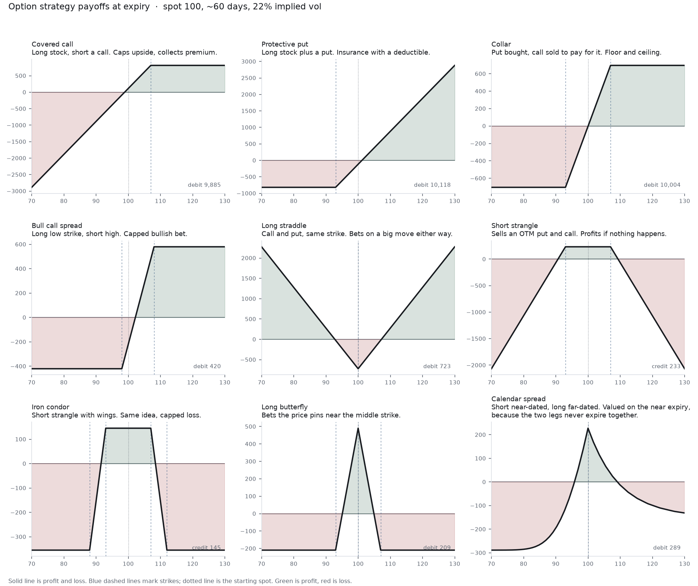
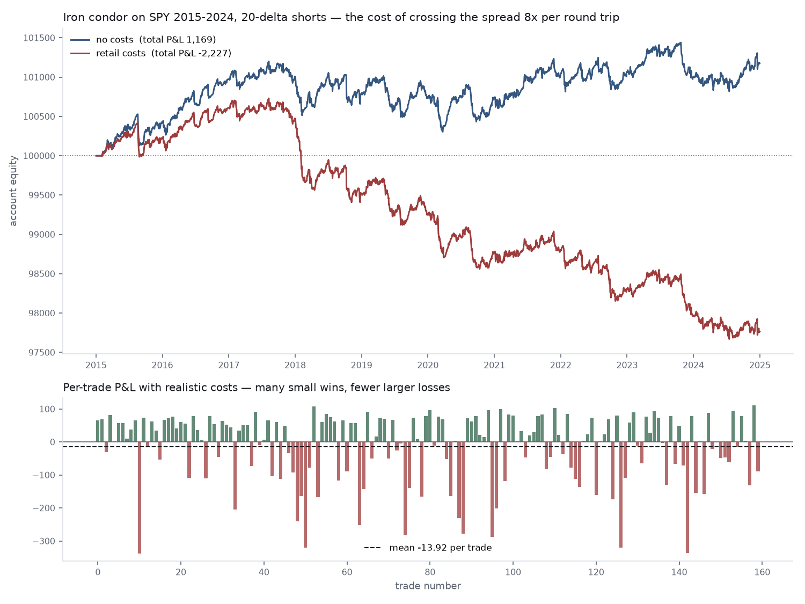

# A Plain Guide to the Strategies

What each structure in `mcop.strategies` actually is, in plain language, and what
the backtester does with them. No prior options knowledge assumed.

If you want the engineering rationale instead — why positions are modelled the
way they are, how the backtest avoids look-ahead — see
[STRATEGIES.md](STRATEGIES.md).

---

## First, the two words you need

An **option** is a contract giving you the right, but not the obligation, to buy
or sell a stock at a fixed price by a fixed date.

- A **call** is the right to *buy*. You want it when the price goes up.
- A **put** is the right to *sell*. You want it when the price goes down.

The fixed price is the **strike**. The deadline is the **expiry**. What you pay
for the contract is the **premium**.

You can be on either side. **Buying** an option costs premium and gives you the
right. **Selling** (or "writing") one collects premium and obliges you to
deliver if the buyer exercises. Selling is where the income strategies below
come from, and also where the open-ended risk lives.

---

## The payoff diagram

Every structure below is one panel above. The picture is profit and loss at
expiry, plotted against where the stock ends up. Reading it:

- **Flat sections** mean your outcome no longer depends on the price — you are
  either capped or floored there.
- **Sloped sections** mean you have directional exposure: the steeper it is, the
  more delta you carry.
- **Kinks** happen at strikes, because that is where an option starts or stops
  paying.

The shape *is* the strategy. Everything else is detail.

---

## The nine structures

### Covered call
**Own 100 shares, sell someone the right to buy them at a higher strike.**

They pay you premium. If the stock finishes below the strike, you keep both the
premium and the shares. If it finishes above, your shares get called away at the
strike and you miss the rest of the rally.

You are trading **upside for income**. The payoff line rises with the stock and
then goes flat: that flat section is the upside you sold.

*Risk:* you still own the stock, so a crash hurts you almost as much as it would
have anyway. The premium is a thin cushion, not protection.

### Protective put
**Own shares, buy the right to sell them at a lower strike.**

This is insurance. However far the stock falls, you can still sell at the strike.
The payoff line is flat below the strike — that flat section is the protection.

*Cost:* like any insurance, you pay a premium and most of the time it expires
worthless. The gap between today's price and the strike is your "deductible".

### Collar
**Protective put, paid for by selling a call.**

You are protected below one strike and capped above another. Often the two
premiums roughly cancel, which is why you hear "zero-cost collar". The payoff is
flat at both ends: floor on the left, ceiling on the right.

Common when someone holds a large position they cannot sell — an employee with
vested stock, say — and wants to bound the outcome cheaply.

### Vertical spread
**Buy one option, sell another of the same type and expiry at a different
strike.**

The version shown is a bull call spread: buy the £98 call, sell the £108 call.
You profit as the stock rises, but only up to £108. The sold call part-funds the
bought one, so it is cheaper than buying the call outright.

**Both the gain and the loss are capped.** That is the entire point of a spread,
and it is why they are the standard way to take a directional view without
open-ended risk.

All four verticals come from one function — which one you get follows from the
right and the strike order:

| Right | Strikes | Result |
|-------|---------|--------|
| call | long below short | bull call spread (debit, bullish) |
| call | long above short | bear call spread (credit, bearish) |
| put | long above short | bear put spread (debit, bearish) |
| put | long below short | bull put spread (credit, bullish) |

### Straddle
**Buy a call and a put at the same strike.**

You do not care which direction the stock moves — you need it to move *a lot*.
The payoff is a V: losses in the middle, profit at both extremes.

Expensive, because you are buying two options. Typically used before a known
event like earnings, where a large move is likely but its direction is not.

A **short** straddle is the reverse: you sell both and profit if the stock sits
still. The V flips upside down, and the losses at the extremes are unbounded.

### Strangle
**Same idea as a straddle, but the call and put are at different
out-of-the-money strikes.**

Cheaper than a straddle, and needs a bigger move to pay off. The panel shows the
**short** version, which is what the backtester trades: you sell both, collect
premium, and win if the stock stays between the strikes.

*Risk:* the profit is capped at the premium received, but the loss is not capped
at all. This is the naked-premium-selling trade — a wide profit zone and a tail
that can take far more than you collected.

### Iron condor
**A short strangle with insurance bought on both sides.**

Four legs: sell an out-of-the-money put and call, then buy a further-out put and
call as protection. You still profit if the stock stays in a range, but the
"wings" cap your worst case.

The payoff is a flat plateau in the middle with steps down on both sides — you
can see exactly where the protection kicks in.

**This is the structure the backtest trades by default**, because it is the one
where every friction matters at once: four legs means four bid/ask crossings on
entry and four more on exit.

### Butterfly
**Buy one low strike, sell two of the middle strike, buy one high.**

The payoff is a tent, peaking at the middle strike. It is a cheap bet that the
stock will *pin* near a specific price. Low cost, low probability, high payoff
if you are right.

### Calendar spread
**Sell a near-dated option and buy a longer-dated one at the same strike.**

Options lose value as expiry approaches, and the near-dated one loses it faster.
You profit from that difference in decay rates.

This is the odd one out, and its panel is drawn differently: the two legs **do
not expire together**, so "the payoff at expiry" is not a well-defined thing.
`Position.payoff_at_expiry()` deliberately refuses to draw one. The panel instead
marks the position on the *near* expiry date, when the short leg dies and the
long leg still holds time value — which is why that curve is smooth rather than
made of straight lines.

---

## What the backtester does

Four of the nine can be traded mechanically by the walk-forward engine:
**iron condor**, **short strangle**, **short put**, **covered call**. The others
need choices a rule cannot make on its own — a butterfly needs you to nominate a
body strike, a calendar needs two expiries.

All four are **short-premium** strategies: they collect money upfront and profit
from time passing. That is deliberate, so the results are comparable.

The loop, one trading day at a time:

1. **Estimate volatility** from the last 21 days of returns — using only data
   from *before* today.
2. **Mark every open position** at current prices.
3. **Close anything that triggered** a rule (below).
4. **Open a new position** if flat, choosing the listed monthly expiry nearest
   45 days out.
5. **Record** cash and account value.

### How strikes get picked

By **delta**, not by price. Delta is roughly the probability an option finishes
in the money, so "sell the 20-delta call" means the same amount of risk whether
markets are calm or wild. "Sell the strike 5% away" does not — 5% out of the
money is nearly certain to expire worthless in a quiet market and a coin-flip in
a volatile one.

### How trades get closed

Whichever comes first:

| Rule | Trigger |
|------|---------|
| Profit target | +50% of the premium collected |
| Stop loss | −200% of the premium collected |
| Time exit | 21 days to expiry |
| Expiry | settled at intrinsic value |
| Assignment | a short leg's time value collapses |

### What the backtest found

**Costs dominate.** The same iron condor rules on **real SPY closes, 2015-2024**,
with and without realistic bid/ask and commission:

| | Frictionless | Retail costs |
|---|---|---|
| Trades | 164 | 160 |
| Win rate | 63.4% | 58.8% |
| Total P&L | **+1,168.82** | **−2,227.35** |
| Per trade | +7.13 | **−13.92** |
| Max drawdown | −0.89% | **−3.04%** |

There was real edge to begin with — the period carried a genuine variance risk
premium and the strategy made money at mid prices. A four-legged structure
crosses the spread eight times per round trip, and that friction (about 21 per
round trip) turned +1,169 into −2,227.

For scale: **buy-and-hold on SPY returned 239.6%** over the same window.

The largest losses land on real events — the August 2015 flash crash and
February 2018's "Volmageddon" are both in the worst six trades. A short-premium
position is structurally short exactly those days.

**Managing trades made it worse.** Sweeping the exit rules with costs switched
off, so the rules are isolated (this sweep was run on the simulated series, so
read the ordering rather than the absolute numbers):

| Profit target | Stop | Trades | Win rate | Total P&L |
|---|---|---|---|---|
| 25% | 200% | 98 | 77.6% | 660 |
| 50% | 200% | 58 | 69.0% | 234 |
| 75% | 200% | 41 | 58.5% | 538 |
| **none** | **none** | **33** | **63.6%** | **1,539** |
| 50% | 100% | 64 | 62.5% | 64 |

Simply holding to the time exit beat every managed variant. The widely
recommended "take profits at 50%, stop at 2x" rule came second from last. Stops
turn recoverable drawdowns into realised losses, and profit targets cut winners
short while leaving the loss tail untouched — visible in that row having the
largest average loss of any configuration.

---

## The caveat that applies to all of it

Option prices in the backtest are **modelled, not observed**. Historical option
chains are a paid dataset, so each option is marked using a volatility surface
anchored to the underlying's actual realised volatility.

The stock path is real — SPY closes from 2015 to 2024, including the 2018
volatility spike, the 2020 crash and the 2022 bear market — so the directional
behaviour is genuine. The option
pricing layer on top is a model, and a smooth one: it cannot reproduce a
volatility spike that front-runs a crash, or spreads gapping untradeable exactly
when you need to get out.

Read the results as **strategy mechanics under a stated volatility model**, not
as a claim about what this would have earned.
